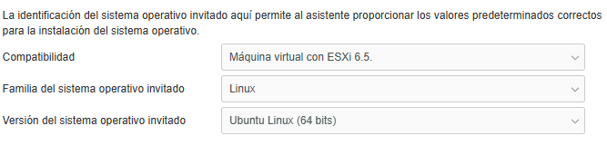
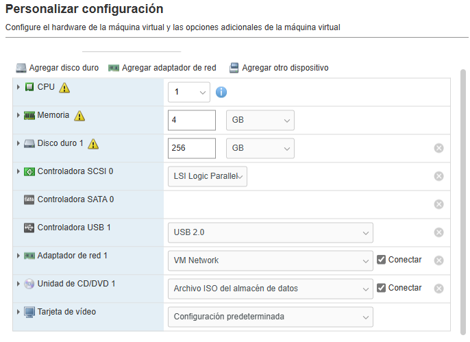

## Crear VM Ubuntu Server para desplegar XIBO CMS

1. Subir la ISO de Ubuntu Server en Almacenamiento/Datastore/Explorador de almacenes de datos/carpeta donde van las isos
2. Sobre Maquinas Virtuales click derecho
3. Crear Nueva Maquina Virtual
4. Poner nombre respetando la siguiente nomenclatura "DC_VM_XIBOCMS"
5. Configuraciones

6. Seleccionar almacenamiento dejamos el base
7. Seleccionar siguientes opciones considerando requerimientos 
 